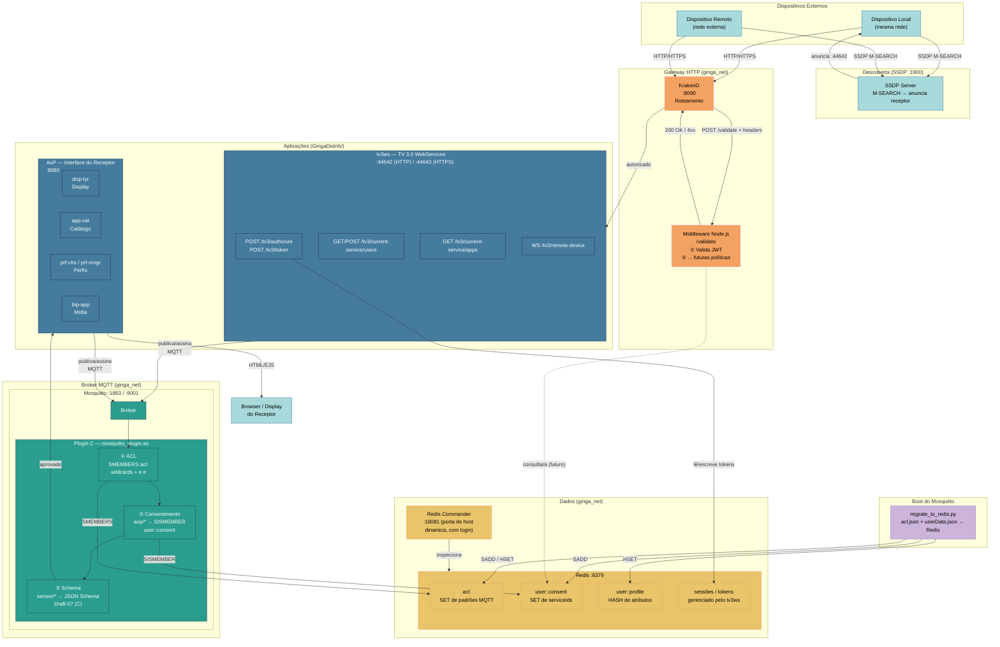

# Diagrama Unificado — GingaDistrib

> **Nota (2026-10-02):** diagrama anterior à consolidação. Não existem mais no código: o KrakenD na porta 8090 com middleware Node `/validate` (hoje a borda é o `edgegateway` 44642/44643 com o plugin `tv30-auth`; ver [04](04-pipeline-http.md) e [05](05-autenticacao.md)); o controle de acesso (ACL) e de consentimento no plugin do broker, que hoje só valida esquema (item 3). As portas 44642/44643 são da borda; o tv3ws escuta em 44652/44653 sem publicá-las. Revisão geral do diagrama: pendente (backlog).

Visão completa do sistema: dispositivos, serviços, segurança, mensageria e dados.

