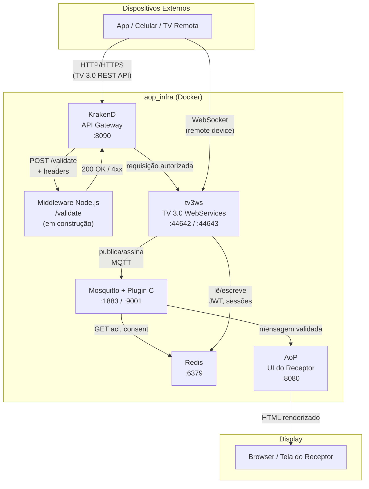
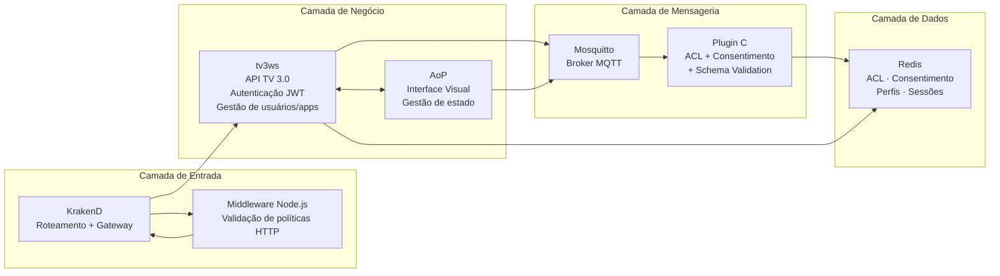

# Visão Geral do Sistema

> **Nota (2026-10-02):** diagrama anterior à consolidação. O KrakenD na porta 8090 e o middleware Node `/validate` não existem mais: a borda é o `edgegateway` (44642/44643) com o plugin `tv30-auth` (ver [04](04-pipeline-http.md) e [05](05-autenticacao.md)). O broker não consulta o Redis (ACL e consentimento saíram no item 3; o plugin C só valida esquema). Revisão geral: pendente (backlog).

Fluxo completo de uma interação no receptor TV 3.0, do dispositivo externo ao display.

---

## Responsabilidades por camada

