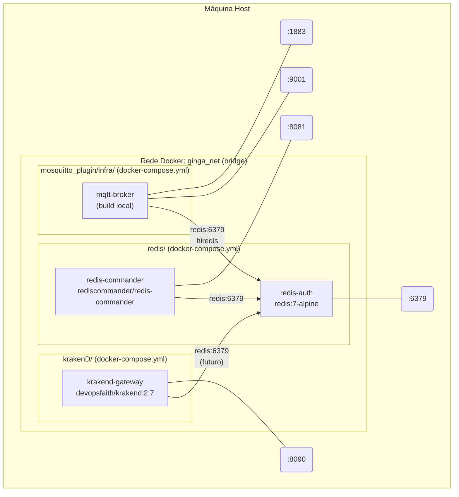
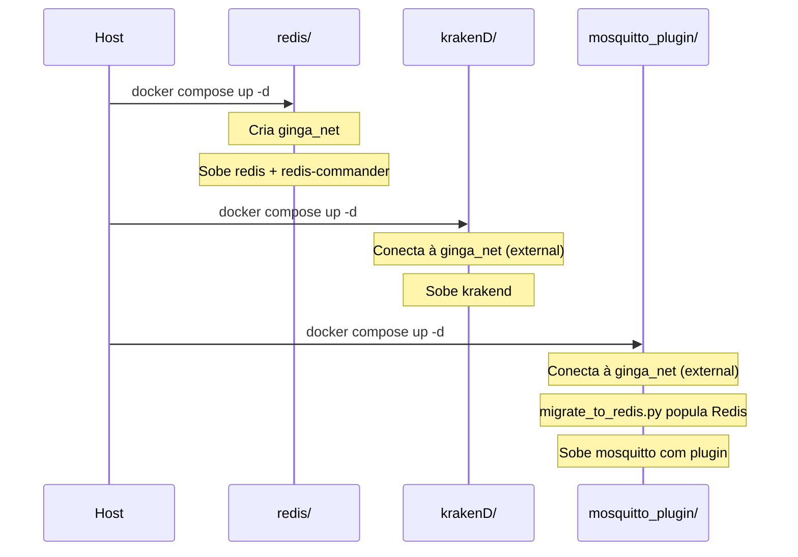

# Rede Docker

> **Nota (2026-10-04): documento histórico, anterior à consolidação de containers.** Os diagramas abaixo não correspondem ao código atual:
> - não há mais `redis-auth` nem container `rediscommander/redis-commander` na `:8081`. O container `redis` (imagem `tv30-redis`) embute a carga inicial e o redis-commander como processo auxiliar, na porta `18081` do container e em porta de host dinâmica (`docker port redis 18081`), com login (D-L1, Luís, 03/10). A 6379 segue publicada e sem senha;
> - não há mais `krakend-gateway` na `:8090`. A borda é o container `edgegateway`, com as superfícies interna (`44642`, fixa da norma C.3.4) e externa (`44643`) e a documentação em porta dinâmica (`docker port edgegateway 8085`);
> - o `mqtt-broker` não consulta o Redis: o controle de acesso a tópicos foi removido (`infra/docker-compose.yml`).
>
> O estado atual está em `infra/README.md` e `infra/ARCHITECTURE.md`. Revisão deste documento: pendente.

Containers, portas expostas e comunicação interna via `ginga_net`.

---

## Ordem de criação e dependência de rede

