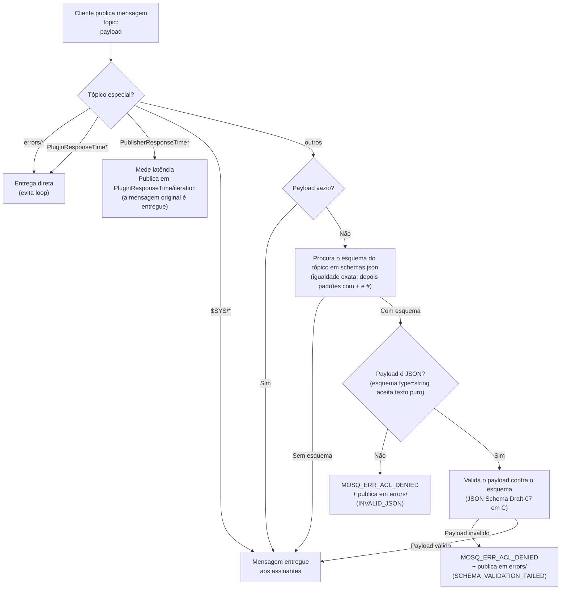
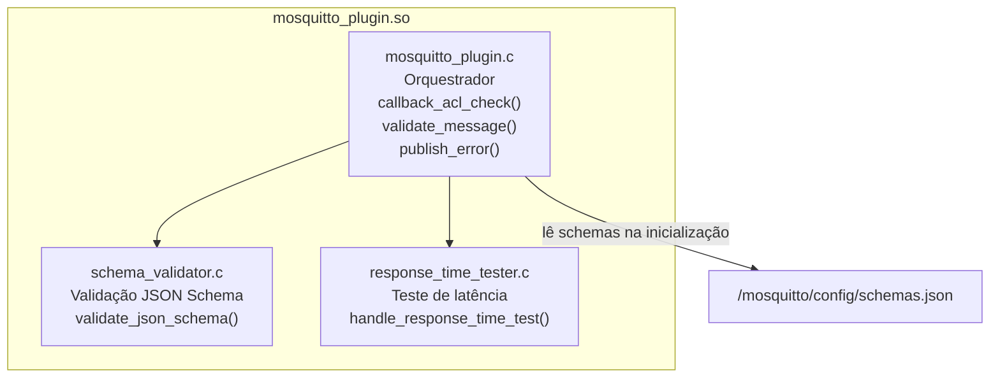
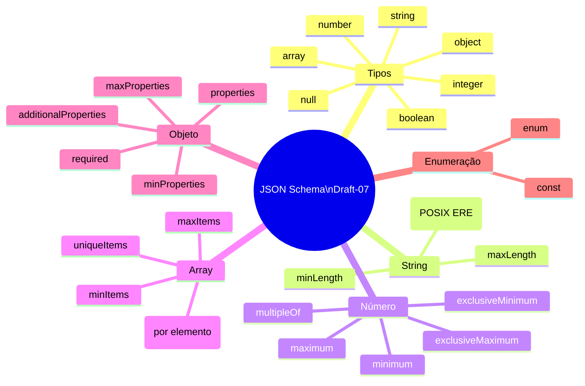

# Pipeline MQTT: validação de esquema

> **Revisto em 2026-10-10 contra o código.** Até esta revisão, este documento descrevia um pipeline de segurança com três camadas (ACL por `client_id` no formato `user_<userId>`, consentimento por `serviceId` e esquema), um módulo `authorize.c` e a carga de ACL e consentimento no Redis pelo `migrate_to_redis.py` na partida. Nada disso existe mais: o controle de acesso a tópicos foi removido por decisão de desenho (comentário em `infra/mqtt-broker/plugin/src/mosquitto_plugin.c`), o plugin não consulta o Redis e só valida esquema e mede latência.

O plugin C intercepta toda mensagem publicada no broker antes de entregá-la aos assinantes. Ele usa o evento `MOSQ_EVT_ACL_CHECK` do Mosquitto só para isso: valida o PUBLISH (`MOSQ_ACL_WRITE`) e deixa passar todo o resto (assinatura e entrega), sem decidir acesso por cliente.

## Fluxo de validação por mensagem



Os esquemas declarados (`infra/mqtt-broker/plugin/config/schemas.json`) cobrem tópicos de estado e de sinalização da plataforma, além dos de teste `sensor/*`. O mapa dos tópicos está em [`08-mqtt-map.md`](./08-mqtt-map.md), e a validação em detalhe, em [`09-schema-validation.md`](./09-schema-validation.md).

---

## Estrutura do Plugin C



---

## Validações de Schema suportadas



---

## Inicialização do container Mosquitto

```mermaid
sequenceDiagram
    participant DC as Docker
    participant EP as entrypoint.sh
    participant MQ as Mosquitto + Plugin

    DC->>EP: entrypoint.sh
    EP->>MQ: exec mosquitto -c /mosquitto/config/mosquitto.conf
    MQ->>MQ: carrega mosquitto_plugin.so
    MQ->>MQ: carrega /mosquitto/config/schemas.json
    Note over MQ: Pronto para receber conexões (1883; WebSocket na 9001)
```

O broker não depende do Redis. O `migrate_to_redis.py` continua na imagem (`/usr/local/bin`), só para depuração manual; a partida não o executa (`infra/mqtt-broker/infra/entrypoint.sh`).
