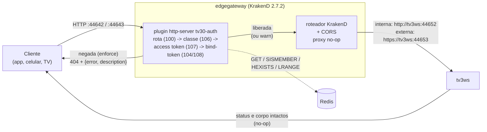
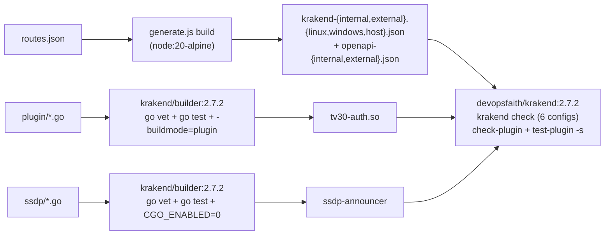

# Pipeline HTTP — a borda (`edgegateway`)

> **Estado do código em 2026-10-02.**
>
> A versão anterior deste documento descrevia um desenho que nunca chegou a validar nada:
> - o KrakenD na porta 8090 delegava a validação a um middleware Node (`POST /validate`), que ninguém chamava;
> - o plugin `consent-validator` era só um proxy de qualquer caminho até o serviço.
>
> As duas peças saíram (`infra@f2eb652`). Mensageria, gateways e Redis são decisões do projeto e não aparecem na norma.

Todo cliente acessa a **borda**, nunca a implementação interna (D10). As portas de API do tv3ws (44652 e 44653) não são publicadas no host; com o override `docker-compose.ssdp.yml` da raiz do TV30, são publicadas só em `127.0.0.1`, para a borda em rede do host. O `edgegateway` é um container só, com:
- **superfície interna:** 44642, a única porta fixa da norma (C.3.4);
- **superfície externa:** 44643;
- **documentação:** 8085.

Os configs das duas superfícies e os dois OpenAPI são gerados **no build** a partir de `edgegateway/routes.json`, a tabela única de rotas (M4).

## Fluxo por requisição

- **Plugin `tv30-auth`** (`edgegateway/plugin/`, em Go). Valida as credenciais segundo a política por rota de `routes.json`. Com `AUTH_ENFORCE=warn` (padrão), só registra no log e marca a resposta com `X-TV30-Auth-Warn`; com `enforce`, bloqueia.
  - Um caminho não declarado recebe 100 sem chegar ao roteador.
  - Um panic no roteador vira 200.
  - Detalhes em [05-autenticacao.md](05-autenticacao.md) e no [README do plugin](../edgegateway/plugin/README.md).
- **Roteador KrakenD.** Só repassa os cabeçalhos e as query strings declarados em cada rota. Toda rota é proxy no-op: o erro do tv3ws (404 com corpo C.3.2) chega intacto ao cliente.
- **CORS.** `Access-Control-Allow-Origin: *`. No preflight, os cabeçalhos permitidos são `Content-Type, Authorization, bind-token, Accept, Accept-Version` (C.4.1.9.3), mais `key`, usado no `DELETE /tv3/bind-context` (C.6.8.4). O cabeçalho exposto é `X-TV30-Auth-Warn`.
- **Variantes.** `EDGE_VARIANT=linux` aponta os backends para o DNS da rede (`tv3ws`). `EDGE_VARIANT=windows` aponta para `host.docker.internal`, no cenário dev-host. `EDGE_VARIANT=host` aponta para `127.0.0.1:44652/44653`, com a borda em rede do host; quem a define é o override `docker-compose.ssdp.yml` da raiz do TV30, que também faz o plugin ler o Redis em `127.0.0.1` (a 6379 publicada). Nos três casos o Redis é o do container.
- **Anúncio SSDP (C.3.4; L6, opção A, decidido pelo Luís em 09/10).** Com `SSDP_ENABLED=true`, que o mesmo override liga, o `entrypoint.sh` sobe também o anunciante `ssdp-announcer` (`edgegateway/ssdp/`, em Go). Detalhes em [05-autenticacao.md](05-autenticacao.md#descoberta-ssdp).
- **Morre-inteiro.** Os dois processos KrakenD, o httpd da documentação e, quando ligado, o anunciante SSDP são vigiados pelo `entrypoint.sh`: se um cair, o container todo cai (para o anunciante, decisão do Luís em 09/10). Configuração inválida do plugin também derruba o processo.

## Build

O `.so` só carrega num binário com o mesmo Go, a mesma libc e a mesma arquitetura. Por isso:
- o builder e a imagem final usam a **mesma versão fixa**;
- o build falha se o plugin não carregar.
