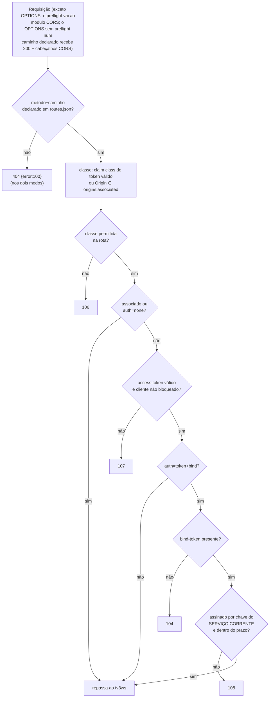
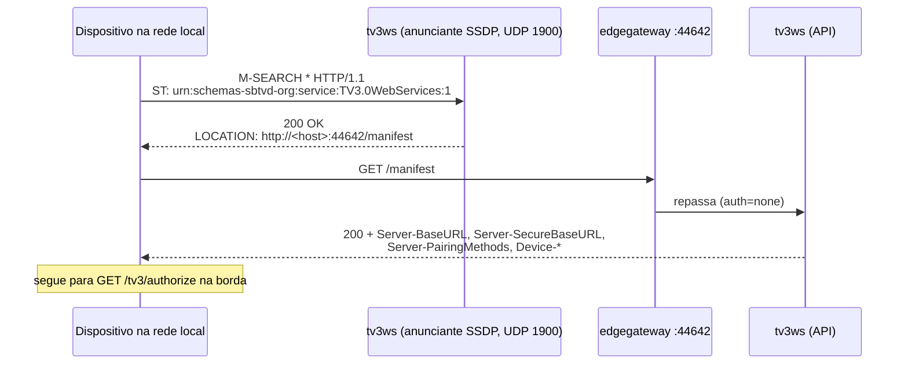

# Autenticação e validação de credenciais (TV 3.0)

> **Estado do código em 2026-10-04:** tv3ws + plugin `tv30-auth` da borda.
>
> A versão anterior deste documento não correspondia ao código:
> - classificava o cliente pelo IP;
> - descrevia `POST /tv3/authorize` e `POST /tv3/token`, mas as duas rotas são `GET`;
> - dava um SSDP com `ST` e `LOCATION` que o código nunca usou.
>
> Onde este texto cita a norma, a seção é da ABNT NBR 25608 (Anexo C). Onde descreve mensageria, gateways ou o Redis, trata-se de decisão do projeto.

## Classes de cliente (P1)

A classe é decidida **uma vez**, na autorização (`GET /tv3/authorize`, em `tv3ws/src/api/client-identification/controller.ts`). Ela viaja no claim `class` do access token e nunca é reinferida a partir do endereço de rede.

| Classe (claim `class`) | Como é reconhecida | Credenciais nas APIs |
|---|---|---|
| `non-local` | `pm` (`qrcode` ou `kex`) presente no `/authorize` | access token; bind-token nas APIs protegidas. Fora de `/authorize` e do primeiro `/token`, HTTPS é obrigatório (C.4.1.6). |
| `local-autonomous` | sem `pm`, e `Origin` fora de `origins:associated` | access token; bind-token nas APIs protegidas |
| `local-associated` | `Origin` presente no hash `origins:associated`, que o AoP grava (origem → id do serviço corrente: o valor de `aop/currentService`, o mesmo de `session:current-service-id`, ou `current-service` sem serviço) | nenhuma no próprio contexto (C.4.1.1) |

O reconhecimento do local associado pelo `Origin` é a lacuna L1. **Decidido pelo Luís em 03/10: fica como está, com o risco aceito.** Não houve mudança de comportamento. Os limites conhecidos:
- **Risco aceito:** fora do navegador, o `Origin` pode ser forjado, e um `Origin` forjado presente em `origins:associated` passa como associado;
- o `Origin` das apps de emissora servidas por proxy no AoP é o do próprio AoP, e o AoP grava em `origins:associated` a origem própria da app (`aop/src/core.js`, `registerAssociatedOrigin`). Essas apps não são reconhecidas como associadas: em `warn` recebem `X-TV30-Auth-Warn: 107`, e em `enforce` seriam bloqueadas. A origem própria por app (P1.3) **não** foi decidida em 03/10 e continua aberta; é pré-requisito do `enforce`;
- a C.4.1.7 (p. 206; p. 224 do PDF) manda o associado usar uma porta de origem atribuída pelo gerenciador de componentes e diz, na mesma seção, que o mecanismo de diferenciação é decisão de implementação. O `Origin` é a decisão deste testbed.

## Emissão do access token (tv3ws)

### `GET /tv3/authorize?clientid=<uuid>&display-name=<nome>[&pm=qrcode|kex[&key=<pub ECDH>]]` (Tabela C.3)

1. O tv3ws publica um pop-up sim/não na TV pelo tópico `aop/display/layers/popup/yesno`, com timeout de 10 s.
2. Só a resposta `"true"` no tópico `.../yesno/response` autoriza. A AoP publica `"false"` quando o espectador recusa e também quando o pop-up expira. Nesse caso, ou sem resposta em 10 s, o cliente vai para `clients:blocked` e a resposta é **102**. Até 02/10/2026, qualquer resposta não vazia autorizava, porque `Boolean("false") === true`.
3. **Local** (associado ou autônomo): a resposta é `{"refreshToken": ...}`.
4. **`clientid` já usado:** 101, para qualquer classe e sem pop-up, tanto para o cliente já autorizado quanto para o recusado (`clients:blocked`). As duas metades têm origens diferentes:
   - o 101 para o cliente já autorizado é decisão do Luís em 03/10 (D-L2; Tabela C.3, "if clientid has been used before", e C.6.1.4.4);
   - o 101 para o recusado segue a nota da Tabela C.3 ("any attempt to authorize immediately returns error 101, without displaying the authorization dialog", p. 233 do PDF). É uma leitura da D-L2 feita na implementação e **ainda a confirmar pelo Luís**.

   Até 03/10, o cliente local já autorizado recebia de novo o refresh token corrente, sem pop-up, e o bloqueado recebia 102.
5. **Não local:**
   - **`qrcode`:** a TV mostra um QR code com uma chave de 32 bytes. O segredo é SHA-256(chave)[0:16]. A resposta é `{"challenge": ...}`.
   - **`kex`:** ECDH P-256. A TV mostra um PIN igual a hash mod 10000, e o segredo é SHA-256(segredo ECDH)[0:16]. A resposta é `{"challenge": ..., "key": ...}`, com `key` = chave parcial do servidor (ponto SEC 1 sem compressão, base64url; Tabela C.3, formato 3, e C.4.3.4). Até a integração de 04/10 o código devolvia só `{challenge}`, e o pareamento por PIN não se completava. A correção é de conformidade (Tabela C.3, formato 3; C.4.3.3, passo 1) e **espera o aval do Luís**.
   - O `challenge` é uma string aleatória cifrada em AES-128-ECB com o segredo.

Erros possíveis no `/authorize`:

| Código | Situação |
|---|---|
| 105 | Falta `clientid`, `display-name` ou `key` (no `kex`). |
| 101 | `pm` não suportado, ou `clientid` já usado (autorizado ou bloqueado), para qualquer classe. |
| 102 | O espectador recusou no pop-up (ou o pop-up expirou). |

### `GET /tv3/token?clientid=<uuid>&(challenge-response=<...>|refresh-token=<...>)` (Tabela C.4)

- **Resposta:** `{"accessToken", "tokenType": "Bearer", "expiresIn", "refreshToken"}`. O refresh token é rotacionado a cada chamada.
- **Primeiro acesso do não local** (por HTTP, com `challenge-response`): a resposta vem cifrada (`application/octet-stream`) e inclui `serverCert`.

Erros possíveis no `/token`:

| Código | Situação |
|---|---|
| 105 | Falta `clientid`, ou faltam os dois: `challenge-response` e `refresh-token`. |
| 102 | Cliente não autorizado, ou `challenge-response` errado. |
| 106 | Cliente não local com `refresh-token` por HTTP. |
| 101 | `refresh-token` que não pertence ao cliente. |

### O access token

- **Formato:** JWT HS256 assinado com `JWT_SECRET`.
- **Claims:** `iat`, `nbf`, `exp` (24 h), `iss` (igual a `JWT_ISSUER`, padrão `GenericIssuer`), `sub` (o `clientid`) e `class`. Ver `tv3ws/src/modules/auth-manager/manager.ts`.
- **Estado no Redis:**
  - `client:{id}`: HASH com `class`, `refreshToken` e `accessToken`;
  - `clients:blocked`: SET.

```mermaid
sequenceDiagram
    participant C as Cliente não local
    participant E as edgegateway (tv30-auth)
    participant T as tv3ws
    participant TV as TV (AoP)

    C->>E: GET /tv3/authorize?clientid&display-name&pm=qrcode
    E->>T: (auth=none; classe != associado)
    T->>TV: MQTT popup/yesno + popup/qrcode
    TV-->>T: espectador autoriza
    T-->>C: 200 {challenge}
    C->>E: GET /tv3/token?clientid&challenge-response
    E->>T: (auth=none)
    T-->>C: 200 (cifrado) {accessToken, refreshToken, serverCert}
    C->>E: GET /tv3/current-service/users/current-user<br/>Authorization: Bearer + bind-token
    E->>E: rota -> classe -> token -> bind-token
    E->>T: repassa (se valido, ou em warn)
    T-->>C: 200 / 404 + corpo C.3.2
```

## Validação na borda (plugin `tv30-auth`)

**Decisão de 28/09 (D1):** toda a validação de credenciais fica na borda, num plugin Go do KrakenD carregado nas duas superfícies do `edgegateway`. O tv3ws só implementa as APIs.

O tv3ws ainda tem duas validações próprias, ativas nos dois modos (`warn` e `enforce`). Decidir o que fazer com elas quando ele ficar só com as APIs é pendência:
- o middleware `authorization.ts`, que valida o token quando ele está presente e responde 107 se ele for inválido;
- o 106 por protocolo, em `basic.ts`: cliente não local que chega por HTTP (pela 44642, cujo backend é `http://tv3ws:44652`).

Os comportamentos provisórios das lacunas (L2, L4, L5) e o reconhecimento do associado pelo `Origin` (L1, decidido em 03/10 com o risco aceito) valem nos **dois** modos: em `warn` só registram e marcam `X-TV30-Auth-Warn`; em `enforce` bloqueiam ou liberam. Em `enforce`, um `Origin` forjado fora do navegador, presente em `origins:associated`, dispensa as credenciais (L1). É o risco aceito.

Toda resposta da borda leva `Access-Control-Allow-Origin: *` (C.4.1.9.2), também sem `Origin` na requisição. O `OPTIONS` que não é preflight, num caminho declarado, recebe 200 com `Access-Control-Allow-Origin`, `Access-Control-Allow-Methods` e `Access-Control-Allow-Headers` (C.4.1.9.3).



### Política por rota

A política está em `edgegateway/routes.json`, nos campos `auth` (`none`, `token` ou `token+bind`) e `classes`. A regra das rotas `token+bind` é o campo "Security requirements" = *shall* de cada API na norma.

| Rotas | auth | classes |
|---|---|---|
| `/health`, `/manifest` | none | todas |
| `/tv3/authorize`, `/tv3/token` | none | autônomo, não local |
| `POST` e `DELETE /tv3/bind-context` | none | associado |
| `GET /tv3/bind-context` | token | autônomo, não local |
| APIs de usuários (C.6.14), inclusive `POST /tv3/{serviceContextId}/users` (variante do testbed, fora da norma; PENDENTE se fica), `apps/{appid}/files` (C.6.4), `POST sensory-effect-renderers/{id}` (C.6.16.3) | token+bind | todas |
| demais | token | todas |

A tabela completa está em `edgegateway/plugin/README.md`.

### Bind-token (C.4.1.3, C.4.1.4, C.6.8)

- **Quem emite:** o receptor **não emite** bind-token. Quem emite é a emissora (A.4.9, C.6.15.4).
- **Registro da chave:** o local associado registra `{alg, key}` em `POST /tv3/bind-context`, uma API do tv3ws. A chave vai para a LIST `bind-context:{serviceId}`, onde `serviceId` é o valor de `session:current-service-id` no momento do registro.
- **Revogação:** `DELETE /tv3/bind-context`, com o cabeçalho `key`.
- **Validação na borda,** em quatro frentes e nesta ordem:
  1. formato JWT;
  2. assinatura;
  3. `nbf` e `exp`;
  4. `iat`.
- **Regras da assinatura:**
  - Algoritmos aceitos: HS256, HS512, RS256 e RS512 (C.4.1.4.8). `none` é sempre inválido.
  - O token tem de ter o mesmo `alg` da chave registrada.
  - Basta que **qualquer** chave registrada para o **serviço corrente** valide. O token de uma emissora não vale no contexto de outra (isolamento, D4).

### Modo e erros

- **`AUTH_ENFORCE=warn`** (padrão): nenhuma falha de credencial é bloqueada; o 100 (rota não declarada) e o 200 (panic do roteador) valem nos dois modos. A borda loga `[tv30-auth] WARN code=...` e acrescenta `X-TV30-Auth-Warn: <código>` à resposta. O motivo é que clientes como o Guaraná ainda não obtêm token.
- **`AUTH_ENFORCE=enforce`:** bloqueia com status 404 e corpo `{"error": <n>, "description": "..."}` (C.3.2), com `Access-Control-Allow-Origin: *`.
- **Redis fora:** em `warn`, passa; em `enforce`, responde `{error: 200}`.

### PENDENTE (Joel)

Os comportamentos provisórios estão marcados no código e listados em `edgegateway/plugin/README.md`. A L1 (reconhecer o associado pelo `Origin`) saiu desta lista: foi decidida pelo Luís em 03/10, com o risco aceito (seção *Classes de cliente*).
- **L2:** `{serviceContextId}` constante no tv3ws;
- **L3:** sem TLS na borda, e portanto sem 106 por protocolo;
- **L4:** 106 ao associado em `/authorize` e `/token` só em `enforce`;
- **L5:** relógio do host em vez do System Time Fragment;
- **L7:** liberação de recursos ao revogar uma chave.

**Redis sem senha e publicado no host (6379): decidido pelo Luís em 03/10.** A conexão com o banco fica como está, sem senha; só a interface administrativa (redis-commander) passou a exigir login. O risco continua: quem alcança a porta grava chaves de bind ou origens associadas e contorna a borda em `enforce` (ver `KNOWN-ISSUES.md` da raiz).

## Descoberta SSDP

**Código:** `tv3ws/src/ssdp-server.ts` e `tv3ws/src/ssdp-config.ts`, com a biblioteca `@lvcabral/node-ssdp`.

- **Anúncio:** o tv3ws anuncia em UDP 1900, a cada 10 s, o serviço `urn:schemas-sbtvd-org:service:TV3.0WebServices:1`.
- **`LOCATION`:** `http://<host>:44642/manifest`, a superfície interna da **borda** (D10). Não aponta para a porta interna do tv3ws.
- **Como o `<host>` é escolhido:** `SSDP_ADVERTISE_HOST`, senão `SERVER_URL`, senão o IP local do processo.
- **Portas:** a borda usa 44642 e 44643, configuráveis por `EDGE_HTTP_PORT` e `EDGE_HTTPS_PORT`.

`GET /manifest` (rota `auth=none` na borda) responde 200; o corpo não carrega informação (o Express manda o texto `OK`). A informação vai nos cabeçalhos:
- `Server-BaseURL` (`<host>:44642`);
- `Server-SecureBaseURL` (`<host>:44643`). **Atenção:** a 44643 da borda ainda é HTTP puro (L3), então esse endereço "seguro" não aceita `https://`. PENDENTE (Joel): o que anunciar aqui até a decisão da L3 (a porta da borda, como hoje, ou o HTTPS do próprio tv3ws, que não é publicado no host);
- `Server-PairingMethods` (`qrcode,kex`);
- `Device-BrandName`, `Device-Model` e `Device-FriendlyName`.

Uma falha do anunciante (bind da 1900 ou erro de socket) encerra o processo com log claro (D9). No SIGTERM, o tv3ws envia `ssdp:byebye`. No boot, o tv3ws registra `[ssdp] AVISO` quando o host anunciado é de loopback, quando `EDGE_HTTP_PORT` difere de 44642 (a C.3.4 fixa 44642 no `Server-BaseURL`) e, enquanto a L3 estiver aberta, que o `Server-SecureBaseURL` aponta para porta sem TLS.



**Em aberto:**
- **L6.** Medido em 02/10 (`docs/ssdp-verificacao.md` na raiz do TV30): o NOTIFY aparece na `eth0` do container e na bridge, e **não sai** da `eth0` da VM do WSL. A descoberta por outro dispositivo da LAN, num Linux nativo, segue sem medição. As opções são deixar o anunciante na borda em host network ou usar um anunciante separado; não há decisão.
- **`SERVER_URL`.** O padrão do compose é `localhost`, e com esse valor o `LOCATION` e o `Server-BaseURL` só funcionam na própria máquina (o tv3ws avisa no boot). Para anunciar outro host, defina `SSDP_ADVERTISE_HOST` no `tv3ws/.env`. PENDENTE (Joel): o padrão (cair no IP local quando `SERVER_URL` for loopback, ou exigir `SSDP_ADVERTISE_HOST`).
