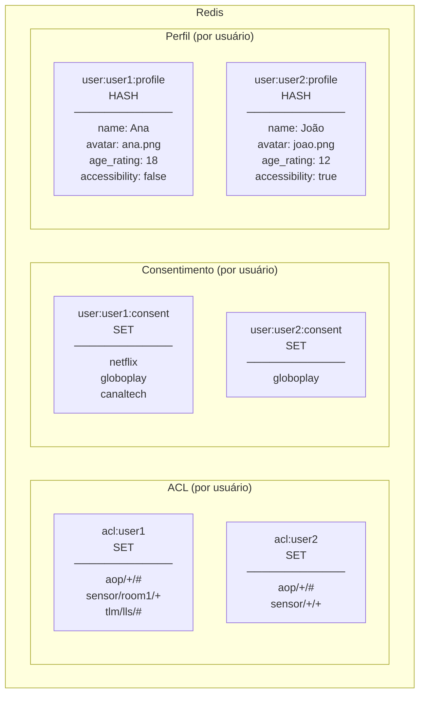
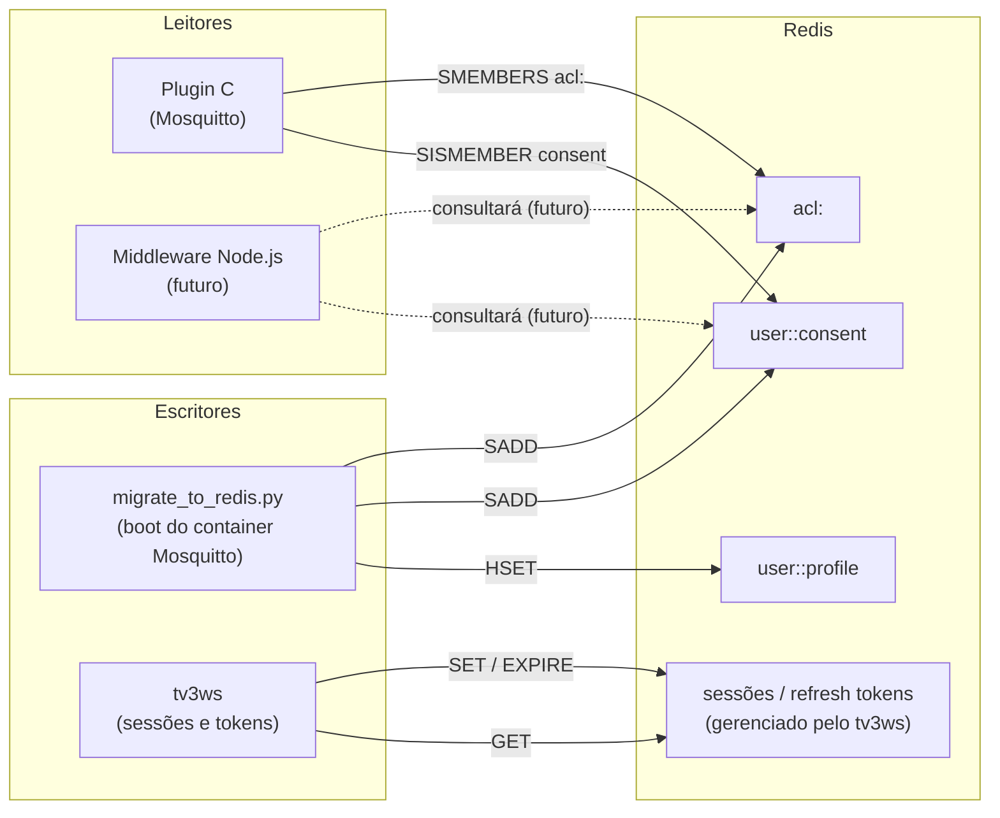
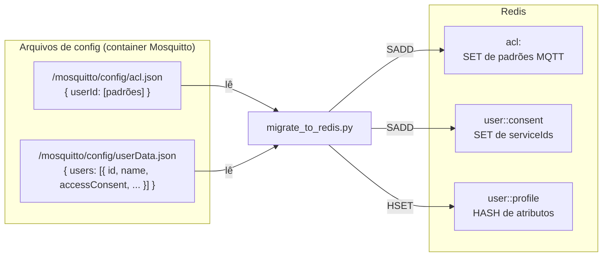

# Modelo de Dados — Redis

> **Nota (2026-10-02, revista em 2026-10-10):** modelo anterior à consolidação. As chaves `acl:*` e a leitura de ACL/consentimento pelo plugin do broker saíram no item 3, e o middleware Node não existe. O `migrate_to_redis.py` rodando no boot do Mosquitto e as chaves `user:<id>:profile` também não correspondem ao código: o script só fica embarcado na imagem do broker para depuração manual (`mqtt-broker/infra/entrypoint.sh`), a carga inicial é do container `redis` (`redis/emit_seed.py` no build, que reaproveita a normalização do script, aplicada uma vez pelo `redis/entrypoint.sh`), e o perfil fica em `user:{id}`. Revisão geral: pendente (backlog).
>
> **Estado corrente, em resumo** (o modelo completo, com quem escreve e quem lê cada família, está em `docs/modelo-redis.md` na raiz do TV30):
> - **Borda** (plugin `tv30-auth`): lê `clients:blocked`, `origins:associated`, `session:current-service-id` e `session:current-service`; desde a reunião de 05/10 com o Joel (D-0510-2), também **escreve** `bind-context:{serviceId}`, porque responde a C.6.8. Ver [05](05-autenticacao.md) e `edgegateway/plugin/README.md`.
> - **Perfis** (`users:index`, `user:{id}`, `user:{id}:consent`): a dona é a plataforma (AoP), que cria, despeja e grava o `lastAccess`; o tv3ws só lê (D-0510-5, aplicação do P5). A carga inicial só escreve no banco vazio.
> - **Clientes** (`client:{id}`, `clients:authorized`, `clients:blocked`): escritos pelo tv3ws; o `clients:authorized` entrou com a D-0510-4.
> - Exceção ao P5 ainda sem decisão: `user:{id}:broadcaster-attrs:{scid}`, gravado pelo tv3ws e apagado pela plataforma no despejo.

O Redis é o repositório compartilhado de estado de segurança do sistema.
Todos os serviços que precisam de ACL, consentimento ou dados de usuário consultam aqui.

## Visão geral das chaves



---

## Quem lê e quem escreve



---

## Origem dos dados: JSONs → Redis



---

## Comandos Redis usados pelo Plugin C

| Operação | Comando Redis | Chave | Descrição |
|---|---|---|---|
| Listar ACL do usuário | `SMEMBERS` | `acl:<user_id>` | Retorna todos os padrões de tópico permitidos |
| Verificar consentimento | `SISMEMBER` | `user:<user_id>:consent` | Checa se serviceId está no set do usuário |

---

## Exemplo de dados populados

```
# ACL do usuário "alice"
acl:alice → { "aop/+/#", "sensor/sala/+", "tlm/lls/#" }

# Consentimento da usuária "alice"
user:alice:consent → { "netflix", "globoplay" }

# Perfil da usuária "alice"
user:alice:profile → {
    name: "Alice",
    avatar: "alice.png",
    age_rating: "18",
    accessibility: "false",
    language: "pt-BR"
}
```

---

## Validação de acesso — exemplos

| Usuário | Tópico | ACL? | Consentimento? | Resultado |
|---|---|---|---|---|
| alice | `aop/netflix/currentApp` | ✅ `aop/+/#` | ✅ netflix | **Permitido** |
| alice | `aop/hbomax/currentApp` | ✅ `aop/+/#` | ❌ hbomax não consentido | **Negado** |
| alice | `sensor/sala/temperature` | ✅ `sensor/sala/+` | N/A | **Permitido** |
| alice | `sensor/quarto/temperature` | ❌ sem padrão | N/A | **Negado** |
| bob | `aop/netflix/currentApp` | ❌ sem ACL | N/A | **Negado** |
