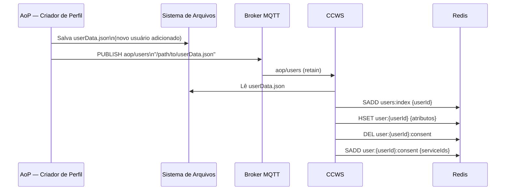
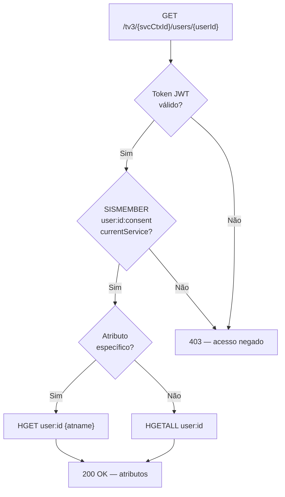
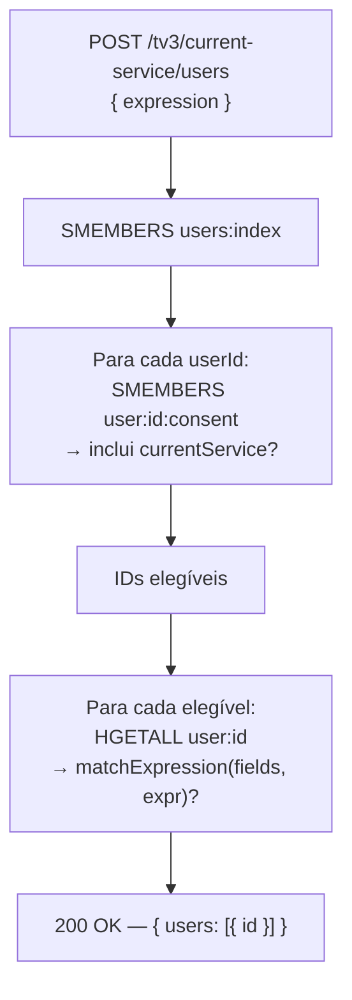
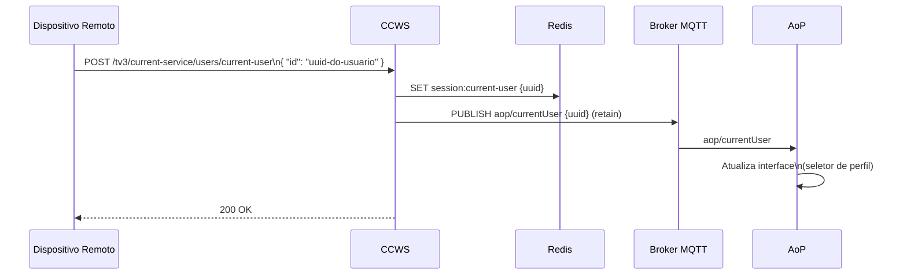

# Gestão de Usuários e Perfis — TV 3.0

Descreve o modelo de dados de usuários e perfis conforme a **ABNT NBR 25608**,
a estratégia de persistência no Redis e os fluxos de leitura e escrita no sistema.

---

## Base normativa

A norma ABNT NBR 25608 (seção 8.7 e Anexo C.6.14) define o perfil do telespectador
como entidade central da plataforma, com três camadas de atributos:

| Camada | Escopo | Exemplos |
|---|---|---|
| **Atributos básicos** | Padronizados, acessíveis por fabricante e emissora | `nickname`, `parentalControl`, `audioLanguage` |
| **Atributos do dispositivo** | Personalizáveis, específicos do receptor | `avatar`, `userInterfaceLanguage` |
| **Atributos de emissora** | Armazenados por contexto de serviço | `att1_broadcaster`, `att2_broadcaster` |

---

## APIs REST definidas pela norma

| Método | Endpoint | Descrição |
|---|---|---|
| `POST` | `/tv3/current-service/users` | Listar usuários com filtro por atributo |
| `GET` | `/tv3/{serviceContextId}/users/{userId}` | Obter perfil completo ou atributo específico |
| `GET` | `/tv3/current-service/users/current-user` | Obter usuário atual |
| `POST` | `/tv3/current-service/users/current-user` | Alterar usuário atual |

Os filtros do `POST /users` suportam operadores `eq`, `neq`, `lt`, `lte`, `gt`, `gte`
com lógica `and`/`or` aninhável — ex: `parentalControl eq true AND maxContentRating gte 14`.

---

## Modelo de dados no Redis

### Chaves de usuário

```
users:index                              Set
  "550e8400-e29b-41d4-a716-446655440000"
  "550e8400-e29b-41d4-a716-446655440001"

user:{userId}                            Hash
  id                                     "550e8400-e29b-41d4-a716-446655440000"
  nickname                               "Joao"             (máx 20 chars — norma)
  avatar                                 "joao.png"
  parentalControl                        "true"
  maxContentRating                       "14"               (L | 10 | 12 | 14 | 16 | 18)
  audioLanguage                          "pt-BR"            (RFC 5646)
  closedCaptioningLanguage               "pt-BR"            (RFC 5646)
  userInterfaceLanguage                  "pt-BR"            (RFC 5646)
  closedCaptioning                       "false"
  closedSigning                          "true"
  closedSigningSide                      "right"            ("left" | "right")
  closedSigningWidth                     "28"               (14–28, percentual)
  audioDescription                       "true"
  dialogEnhancement                      "true"
  voiceGuidance                          "true"

user:{userId}:consent                    Set
  "urn:sbtvd:service:globoplay"
  "urn:sbtvd:service:canaltech"

user:{userId}:broadcaster-attrs:{svcId}  Hash
  att1_broadcaster                       "valor_customizado_1"
  att2_broadcaster                       "valor_customizado_2"
```

### Sessão de usuário

```
session:current-user                     String
  "550e8400-e29b-41d4-a716-446655440000"
```

---

## Atributos do perfil — referência normativa completa

Definidos na ABNT NBR 25608, seção 8.7, Tabela 7:

| Atributo | Tipo | Obrigatório | Restrições (norma) | Justificativa |
|---|---|---|---|---|
| `id` | UUID string | Sim | — | Identificador único do telespectador |
| `nickname` | string | Sim | Máx 20 chars | Nome exibido na interface |
| `parentalControl` | boolean | Sim | — | Controle parental ativo/inativo |
| `maxContentRating` | string | Se `parentalControl=true` | `L \| 10 \| 12 \| 14 \| 16 \| 18` | Faixa etária máxima permitida |
| `audioLanguage` | string | Sim | RFC 5646 | Idioma do áudio preferido |
| `closedCaptioningLanguage` | string | Sim | RFC 5646 | Idioma da legenda |
| `userInterfaceLanguage` | string | Sim | RFC 5646 | Idioma da interface |
| `closedCaptioning` | boolean | Sim | — | Legenda oculta ativa (obrigação ABNT NBR 25605) |
| `closedSigning` | boolean | Sim | — | Janela de Libras ativa (obrigação legal) |
| `closedSigningSide` | string | Se `closedSigning=true` | `"left" \| "right"` | Lado da janela de Libras |
| `closedSigningWidth` | integer | Se `closedSigning=true` | 14–28 (percentual) | Largura da janela de Libras |
| `audioDescription` | boolean | Sim | — | Audiodescrição ativa (ABNT NBR 25606) |
| `dialogEnhancement` | boolean | Sim | — | Realce de diálogo |
| `voiceGuidance` | boolean | Sim | — | Guia por voz |
| `avatar` | file path | Não | — | Foto/ícone do perfil |

> **Nota:** Os atributos de acessibilidade (`closedCaptioning`, `closedSigning`,
> `audioDescription`, `dialogEnhancement`, `voiceGuidance`) são obrigações legais
> no padrão brasileiro de TV digital — a perda desses dados degrada a experiência
> de usuários com deficiência e pode constituir infração normativa.

---

## Fluxo de escrita: criação de perfil



---

## Fluxo de leitura: API REST → Redis



---

## Fluxo de leitura: lista de usuários com filtro



O filtro de expressão suporta:

| Tipo | Estrutura JSON | Exemplo |
|---|---|---|
| Simples | `{ "attribute": "...", "comparator": "eq", "value": "..." }` | `parentalControl eq true` |
| AND | `{ "and": [ expr, expr, ... ] }` | `parentalControl eq true AND maxContentRating gte 12` |
| OR | `{ "or": [ expr, expr, ... ] }` | `audioDescription eq true OR voiceGuidance eq true` |

---

## Fluxo de alteração do usuário atual



---

## Privacidade e consentimento (LGPD / norma seção 8.7.2)

O consentimento é gerenciado pelo **Privacy Manager** com base em
Privacy Record Request Descriptions (PRRD) sinalizadas via SLS.

```
user:{userId}:consent    Set
  "urn:sbtvd:service:globoplay"       ← serviço com consentimento
  "urn:sbtvd:service:canaltech"
```

- O plugin Mosquitto consulta `SISMEMBER user:{userId}:consent {serviceId}` para
  autorizar publicações MQTT vinculadas a serviços.
- O CCWS aplica o mesmo filtro nas APIs REST — usuários sem consentimento para o
  `currentService` não aparecem em listagens nem têm atributos expostos.
- Centralizar no Redis elimina inconsistência entre serviços e atende à LGPD.

---

## Atributos de emissora por contexto (norma Anexo C.6.14.2)

Cada emissora pode armazenar atributos personalizados por usuário, isolados pelo
`serviceContextId`:

```
user:{userId}:broadcaster-attrs:{serviceContextId}   Hash
  att1_broadcaster    "valor_customizado_1"
  att2_broadcaster    "valor_customizado_2"
```

Isso permite personalização de experiência (ex: configurações de um aplicativo
interativo de uma emissora específica) sem interferir nos atributos básicos do perfil.

---

## Resumo das operações Redis

| Operação | Comando | Chave | Quando |
|---|---|---|---|
| Registrar usuário | `SADD` | `users:index` | Sync do userData.json |
| Salvar atributos | `HSET` | `user:{id}` | Sync do userData.json |
| Salvar consentimento | `SADD` | `user:{id}:consent` | Sync do userData.json |
| Listar todos os IDs | `SMEMBERS` | `users:index` | POST /users |
| Verificar consentimento | `SISMEMBER` | `user:{id}:consent` | GET /users/{id}, POST /users |
| Ler perfil completo | `HGETALL` | `user:{id}` | GET /users/{id} |
| Ler atributo único | `HGET` | `user:{id}` | GET /users/{id}?attribute=X |
| Salvar usuário atual | `SET` | `session:current-user` | POST /current-user / MQTT |
| Ler usuário atual | `GET` | `session:current-user` | GET /current-user, boot |
| Atributos de emissora | `HSET` / `HGETALL` | `user:{id}:broadcaster-attrs:{svcId}` | PUT/GET atributos de emissora |
