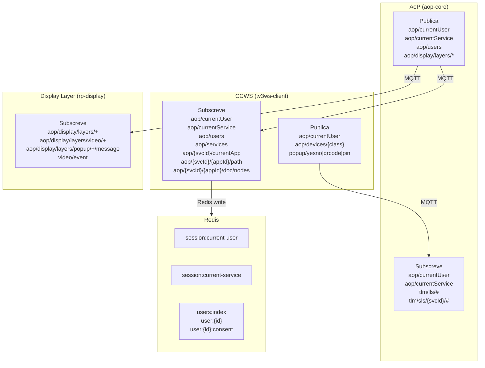

# Mapa de Tópicos MQTT — TV 3.0

Mapeamento completo de publicações e subscrições MQTT no ecossistema TV 3.0,
gerado a partir da análise estática dos fontes em `aop`, `ccws` e `infra`.

---

## Clientes MQTT ativos

| Client ID | Processo | Arquivo |
|---|---|---|
| `aop-core` | AoP — Application-oriented Platform | `aop/src/core.js` |
| `tv3ws-client` | CCWS — CC WebServices | `ccws/src/mqtt-client.ts` |
| `rp-display` | AoP — Display Layer (browser) | `aop/src/modules/disp-lyr/view.ejs` |

---

## Tópicos de sessão e usuário

### `aop/currentUser`

| Direção | Arquivo | Linha | Detalhe |
|---|---|---|---|
| **PUB** | `aop/src/core.js` | 141 | `setCurrentUser()` — payload: UUID, retain: true |
| **PUB** | `ccws/src/modules/user-api/service.ts` | 124 | `setCurrentUser()` — payload: UUID, retain: true |
| **SUB** | `aop/src/core.js` | 44 | handler: `loadCurrentUser()` |
| **SUB** | `ccws/src/modules/user-api/service.ts` | 64 | handler: `updateCurrentUser()` → `session:current-user` no Redis |

### `aop/currentService`

| Direção | Arquivo | Linha | Detalhe |
|---|---|---|---|
| **PUB** | `aop/src/core.js` | 168 | `setCurrentService()` — payload: serviceId, retain: true |
| **PUB** | `aop/src/core.js` | 174 | `unsetCurrentService()` — payload: `''`, retain: true |
| **SUB** | `aop/src/core.js` | 45 | handler: `loadCurrentService()` |
| **SUB** | `ccws/src/modules/user-api/service.ts` | 65 | handler: `updateCurrentService()` → `session:current-service-id` no Redis |
| **SUB** | `ccws/src/core.ts` | 168 | handler: `currentService()` → `session:current-service` Hash no Redis |

### `aop/users`

| Direção | Arquivo | Linha | Detalhe |
|---|---|---|---|
| **PUB** | `aop/src/modules/prf-mngr/service.js` | 105 | `createUser()` — payload: caminho do `userData.json` |
| **SUB** | `ccws/src/modules/user-api/service.ts` | 66 | handler: `syncUsersFromFile()` → sincroniza usuários para Redis |

### `aop/services`

| Direção | Arquivo | Linha | Detalhe |
|---|---|---|---|
| **SUB** | `ccws/src/core.ts` | 176 | handler: `loadServiceData()` — parse JSON com lista de serviços |

---

## Tópicos de dispositivos remotos

### `aop/devices/{devclass}`

| Direção | Arquivo | Linha | Detalhe |
|---|---|---|---|
| **PUB** | `ccws/src/modules/remotedevice-manager/manager.ts` | 39 | `addRemoteDevice()` — payload: JSON array de handles, retain: true |
| **PUB** | `ccws/src/modules/remotedevice-manager/manager.ts` | 61 | `removeRemoteDevice()` — payload: JSON array de handles, retain: true |

---

## Tópicos de aplicação (dinâmicos)

### `aop/{serviceId}/currentApp`

| Direção | Arquivo | Linha | Detalhe |
|---|---|---|---|
| **SUB** | `ccws/src/core.ts` | 149 | handler: `setAppId()` — registra app atual |

### `aop/{serviceId}/{appId}/path`

| Direção | Arquivo | Linha | Detalhe |
|---|---|---|---|
| **SUB** | `ccws/src/core.ts` | 96 | handler: `setAppBaseURL()` — URL base da app |

### `aop/{serviceId}/{appId}/doc/nodes`

| Direção | Arquivo | Linha | Detalhe |
|---|---|---|---|
| **SUB** | `ccws/src/core.ts` | 102 | handler: `setAppNodes()` — array de nós NCL/HTML5 |

### `aop/{serviceId}/{appId}/doc/{nodeId}/{iface}/actionNotification`

| Direção | Arquivo | Linha | Detalhe |
|---|---|---|---|
| **PUB** | `ccws/src/modules/remotedevice-manager/remote-device.ts` | 216–222 | `publishTransitionMetadata()` — transition, user, value |
| **SUB** | `ccws/src/modules/remotedevice-manager/remote-device.ts` | 351 | handler: `setNodeInterfaces()` — `{prefix}/interfaces` |
| **SUB** | `ccws/src/modules/remotedevice-manager/remote-device.ts` | 353–354 | handler: `onMqttMessage()` — `preparationEvent` e `presentationEvent` |
| **SUB** | `ccws/src/modules/remotedevice-manager/remote-device.ts` | 384 | handler: `setPropertyValue()` — `{iface}/attributionEvent/value` |

---

## Tópicos de display (camadas visuais)

### `aop/display/layers/rxgui`

| Direção | Arquivo | Linha | Detalhe |
|---|---|---|---|
| **PUB** | `aop/src/core.js` | 92 | `setDisplayGui()` — payload: caminho da GUI |
| **SUB** | `aop/src/modules/disp-lyr/view.ejs` | 152 | wildcard `aop/display/layers/+` |

### `aop/display/layers/graphics`

| Direção | Arquivo | Linha | Detalhe |
|---|---|---|---|
| **PUB** | `aop/src/core.js` | 99 | `setDisplayGraphics()` — payload: URL da app gráfica ou `''` |
| **SUB** | `aop/src/modules/disp-lyr/view.ejs` | 152 | wildcard `aop/display/layers/+` |

### `aop/display/layers/video/url`

| Direção | Arquivo | Linha | Detalhe |
|---|---|---|---|
| **PUB** | `aop/src/core.js` | 106–109 | `setVideoURL()` — payload: URL HLS/DASH ou proxy |
| **SUB** | `aop/src/modules/disp-lyr/view.ejs` | 153 | wildcard `aop/display/layers/video/+` |

### `aop/display/layers/video/size`

| Direção | Arquivo | Linha | Detalhe |
|---|---|---|---|
| **PUB** | `aop/src/core.js` | 114 | `setVideoSize()` — payload: JSON `{top, left, width, height}` |
| **SUB** | `aop/src/modules/disp-lyr/view.ejs` | 153 | wildcard `aop/display/layers/video/+` |

---

## Tópicos de popups (UI)

### `aop/display/layers/popup/yesno/message`

| Direção | Arquivo | Linha | Detalhe |
|---|---|---|---|
| **PUB** | `ccws/src/core.ts` | 263 | `showYesNoPopUpAsync()` — payload: JSON `{value, timeout}` |
| **SUB** | `aop/src/modules/disp-lyr/view.ejs` | 154 | wildcard `aop/display/layers/popup/+/message` |

### `aop/display/layers/popup/yesno/response`

| Direção | Arquivo | Linha | Detalhe |
|---|---|---|---|
| **SUB** | `ccws/src/core.ts` | 261 | handler temporal em `showYesNoPopUpAsync()` — resolve Promise |

### `aop/display/layers/popup/qrcode`

| Direção | Arquivo | Linha | Detalhe |
|---|---|---|---|
| **PUB** | `ccws/src/core.ts` | 270 | `showQRCodePopUp()` — payload: JSON `{value, timeout}` |
| **SUB** | `aop/src/modules/disp-lyr/view.ejs` | 154 | wildcard `aop/display/layers/popup/+/message` |

### `aop/display/layers/popup/pin`

| Direção | Arquivo | Linha | Detalhe |
|---|---|---|---|
| **PUB** | `ccws/src/core.ts` | 276 | `showPINPopUp()` — payload: JSON `{value, timeout}` |
| **SUB** | `aop/src/modules/disp-lyr/view.ejs` | 154 | wildcard `aop/display/layers/popup/+/message` |

---

## Tópicos de telemetria (LLS/SLS)

### `tlm/lls/#`

| Direção | Arquivo | Linha | Detalhe |
|---|---|---|---|
| **SUB** | `aop/src/core.js` | 46 | handler: `loadLLSMetadata()` — Bootstrap Application Manifest |

### `tlm/sls/{serviceId}/#`

| Direção | Arquivo | Linha | Detalhe |
|---|---|---|---|
| **SUB** | `aop/src/core.js` | 169 | subscrito dinamicamente em `setCurrentService()` — handler: `loadSLSMetadata()` |

---

## Tópico de evento de vídeo

### `video/event`

| Direção | Arquivo | Linha | Detalhe |
|---|---|---|---|
| **SUB** | `aop/src/modules/disp-lyr/view.ejs` | 155 | dispara `CustomEvent stream_event` para iframe de gráficos |

---

## Visão geral — fluxo de dados

---

## Retenção de mensagens (retain)

| Tópico | retain | Motivo |
|---|---|---|
| `aop/currentUser` | `true` | Dispositivos que conectam depois recebem o usuário atual |
| `aop/currentService` | `true` | Dispositivos que conectam depois recebem o serviço sintonizado |
| `aop/devices/{class}` | `true` | Lista de dispositivos remotos deve ser reproduzida ao reconectar |
| Demais tópicos | `false` (padrão) | Estado efêmero — não faz sentido reproduzir |
