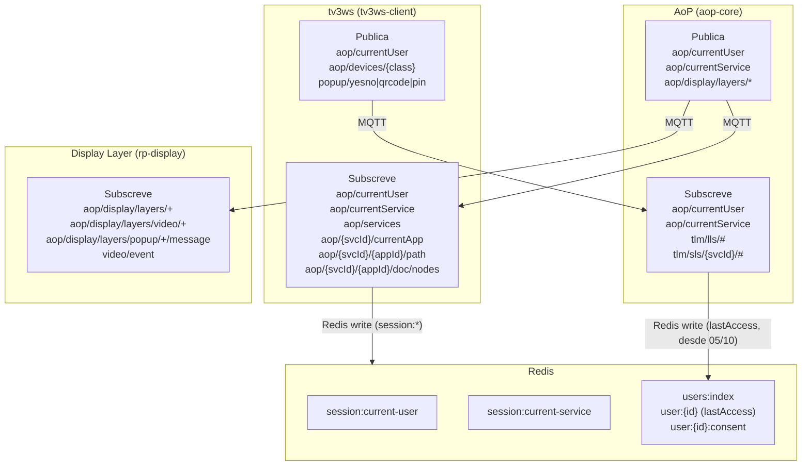

# Mapa de Tópicos MQTT — TV 3.0

Mapeamento completo de publicações e subscrições MQTT no ecossistema TV 3.0,
gerado a partir da análise estática dos fontes em `aop`, `tv3ws` e `infra`.

> Caminhos e linhas do tv3ws conferidos em 2026-10-02 (renome `ccws` → `tv3ws` e mudança de `src/modules/user-api/` para `src/api/user/`). Os do `aop` e do `infra` não foram reconferidos. Em 2026-10-10, depois das mudanças da reunião de 05/10 com o Joel, foram reconferidos os tópicos `aop/currentUser`, `aop/currentService`, `aop/users` e `aop/devices/{devclass}`, nos dois lados. Na mesma data, a assinatura que sobrava de `aop/users` saiu do AoP, e o esquema do tópico saiu do `schemas.json` do broker; as linhas do `aop/src/core.js` desses tópicos foram reconferidas depois disso.

---

## Clientes MQTT ativos

| Client ID | Processo | Arquivo |
|---|---|---|
| `aop-core` | AoP — Application-oriented Platform | `aop/src/core.js` |
| `tv3ws-client` | tv3ws — TV 3.0 WebServices | `tv3ws/src/mqtt-client.ts` |
| `rp-display` | AoP — Display Layer (browser) | `aop/src/modules/disp-lyr/view.ejs` |

---

## Tópicos de sessão e usuário

### `aop/currentUser`

| Direção | Arquivo | Linha | Detalhe |
|---|---|---|---|
| **PUB** | `aop/src/core.js` | 236 | `setCurrentUser()` — grava antes o `lastAccess` do perfil; payload: UUID, retain: true |
| **PUB** | `tv3ws/src/api/user/service.ts` | 106 | `setCurrentUser()` (C.6.14.4) — payload: UUID, retain: true |
| **SUB** | `aop/src/core.js` | 85 | handler: `loadCurrentUser()` → grava o `lastAccess` do perfil (`touchLastAccess`, desde 05/10, D-0510-5) |
| **SUB** | `tv3ws/src/api/user/service.ts` | 65 | handler: `updateCurrentUser()` → `session:current-user` no Redis (até 05/10, também o `lastAccess`) |

### `aop/currentService`

| Direção | Arquivo | Linha | Detalhe |
|---|---|---|---|
| **PUB** | `aop/src/core.js` | 263 | `setCurrentService()` — payload: serviceId, retain: true |
| **PUB** | `aop/src/core.js` | 269 | `unsetCurrentService()` — payload: `''`, retain: true |
| **SUB** | `aop/src/core.js` | 86 | handler: `loadCurrentService()` |
| **SUB** | `tv3ws/src/api/user/service.ts` | 66 | handler: `updateCurrentService()` → `session:current-service-id` no Redis |
| **SUB** | `tv3ws/src/core.ts` | 168 | handler: `currentService()` → `session:current-service` Hash no Redis |

### `aop/users`

Fora de uso desde a rodada da reunião de 05/10 com o Joel (D-0510-5): o tv3ws não sincroniza mais perfis a partir do `userData.json`, e a plataforma (AoP) é a dona deles. A linha de publicação que esta tabela listava (`aop/src/modules/prf-mngr/service.js`, `createUser()`) não existia mais no código; a última função que publicava o tópico (`notifyUsersChanged`, em `aop/src/core.js`) não tinha chamador e saiu na mesma rodada. Desde 10/10, ninguém publica nem assina o tópico: a assinatura que sobrava no AoP saiu, e o esquema dele saiu de `mqtt-broker/plugin/config/schemas.json`.

| Direção | Arquivo | Linha | Detalhe |
|---|---|---|---|
| ~~SUB~~ | `aop/src/core.js` | — | handler `loadUserData()`: assinatura removida em 10/10 (a carga da lista de perfis segue no `connect`) |
| ~~SUB~~ | `tv3ws/src/api/user/service.ts` | — | `syncUsersFromFile()`: removido em 05/10 |

### `aop/services`

| Direção | Arquivo | Linha | Detalhe |
|---|---|---|---|
| **SUB** | `tv3ws/src/core.ts` | 176 | handler: `loadServiceData()` — parse JSON com lista de serviços |

---

## Tópicos de dispositivos remotos

### `aop/devices/{devclass}`

| Direção | Arquivo | Linha | Detalhe |
|---|---|---|---|
| **PUB** | `tv3ws/src/modules/remotedevice-manager/manager.ts` | 87 | `addRemoteDevice()` — payload: JSON array de handles, retain: true. Desde 05/10 (D-0510-6), só publica depois de gravar o espelho no Redis |
| **PUB** | `tv3ws/src/modules/remotedevice-manager/manager.ts` | 110 | `removeRemoteDevice()` — payload: JSON array de handles (ou `''` se não sobrou nenhum), retain: true. Também depois da remoção no Redis |

---

## Tópicos de aplicação (dinâmicos)

### `aop/{serviceId}/currentApp`

| Direção | Arquivo | Linha | Detalhe |
|---|---|---|---|
| **SUB** | `tv3ws/src/core.ts` | 149 | handler: `setAppId()` — registra app atual |

### `aop/{serviceId}/{appId}/path`

| Direção | Arquivo | Linha | Detalhe |
|---|---|---|---|
| **SUB** | `tv3ws/src/core.ts` | 96 | handler: `setAppBaseURL()` — URL base da app |

### `aop/{serviceId}/{appId}/doc/nodes`

| Direção | Arquivo | Linha | Detalhe |
|---|---|---|---|
| **SUB** | `tv3ws/src/core.ts` | 102 | handler: `setAppNodes()` — array de nós NCL/HTML5 |

### `aop/{serviceId}/{appId}/doc/{nodeId}/{iface}/actionNotification`

| Direção | Arquivo | Linha | Detalhe |
|---|---|---|---|
| **PUB** | `tv3ws/src/modules/remotedevice-manager/remote-device.ts` | 216–222 | `publishTransitionMetadata()` — transition, user, value |
| **SUB** | `tv3ws/src/modules/remotedevice-manager/remote-device.ts` | 351 | handler: `setNodeInterfaces()` — `{prefix}/interfaces` |
| **SUB** | `tv3ws/src/modules/remotedevice-manager/remote-device.ts` | 353–354 | handler: `onMqttMessage()` — `preparationEvent` e `presentationEvent` |
| **SUB** | `tv3ws/src/modules/remotedevice-manager/remote-device.ts` | 384 | handler: `setPropertyValue()` — `{iface}/attributionEvent/value` |

---

## Tópicos de display (camadas visuais)

### `aop/display/layers/rxgui`

| Direção | Arquivo | Linha | Detalhe |
|---|---|---|---|
| **PUB** | `aop/src/core.js` | 92 | `setDisplayGui()` — payload: caminho da GUI |
| **SUB** | `aop/src/modules/disp-lyr/view.ejs` | 152 | wildcard `aop/display/layers/+` |

### `aop/display/layers/graphics`

| Direção | Arquivo | Linha | Detalhe |
|---|---|---|---|
| **PUB** | `aop/src/core.js` | 99 | `setDisplayGraphics()` — payload: URL da app gráfica ou `''` |
| **SUB** | `aop/src/modules/disp-lyr/view.ejs` | 152 | wildcard `aop/display/layers/+` |

### `aop/display/layers/video/url`

| Direção | Arquivo | Linha | Detalhe |
|---|---|---|---|
| **PUB** | `aop/src/core.js` | 106–109 | `setVideoURL()` — payload: URL HLS/DASH ou proxy |
| **SUB** | `aop/src/modules/disp-lyr/view.ejs` | 153 | wildcard `aop/display/layers/video/+` |

### `aop/display/layers/video/size`

| Direção | Arquivo | Linha | Detalhe |
|---|---|---|---|
| **PUB** | `aop/src/core.js` | 114 | `setVideoSize()` — payload: JSON `{top, left, width, height}` |
| **SUB** | `aop/src/modules/disp-lyr/view.ejs` | 153 | wildcard `aop/display/layers/video/+` |

---

## Tópicos de popups (UI)

### `aop/display/layers/popup/yesno/message`

| Direção | Arquivo | Linha | Detalhe |
|---|---|---|---|
| **PUB** | `tv3ws/src/core.ts` | 266 | `showYesNoPopUpAsync()` — payload: JSON `{value, timeout}` |
| **SUB** | `aop/src/modules/disp-lyr/view.ejs` | 154 | wildcard `aop/display/layers/popup/+/message` |

### `aop/display/layers/popup/yesno/response`

| Direção | Arquivo | Linha | Detalhe |
|---|---|---|---|
| **PUB** | `aop/public/js/popup.js` | 21, 27, 33 | payload `"true"` (Sim) ou `"false"` (Não, ou timeout do pop-up) |
| **SUB** | `tv3ws/src/core.ts` | 264 | handler temporal em `showYesNoPopUpAsync()` — resolve a Promise; só `"true"` autoriza |

### `aop/display/layers/popup/qrcode`

| Direção | Arquivo | Linha | Detalhe |
|---|---|---|---|
| **PUB** | `tv3ws/src/core.ts` | 273 | `showQRCodePopUp()` — payload: JSON `{value, timeout}` |
| **SUB** | `aop/src/modules/disp-lyr/view.ejs` | 154 | wildcard `aop/display/layers/popup/+/message` |

### `aop/display/layers/popup/pin`

| Direção | Arquivo | Linha | Detalhe |
|---|---|---|---|
| **PUB** | `tv3ws/src/core.ts` | 279 | `showPINPopUp()` — payload: JSON `{value, timeout}` |
| **SUB** | `aop/src/modules/disp-lyr/view.ejs` | 154 | wildcard `aop/display/layers/popup/+/message` |

---

## Tópicos de telemetria (LLS/SLS)

### `tlm/lls/#`

| Direção | Arquivo | Linha | Detalhe |
|---|---|---|---|
| **SUB** | `aop/src/core.js` | 46 | handler: `loadLLSMetadata()` — Bootstrap Application Manifest |

### `tlm/sls/{serviceId}/#`

| Direção | Arquivo | Linha | Detalhe |
|---|---|---|---|
| **SUB** | `aop/src/core.js` | 169 | subscrito dinamicamente em `setCurrentService()` — handler: `loadSLSMetadata()` |

---

## Tópico de evento de vídeo

### `video/event`

| Direção | Arquivo | Linha | Detalhe |
|---|---|---|---|
| **SUB** | `aop/src/modules/disp-lyr/view.ejs` | 155 | dispara `CustomEvent stream_event` para iframe de gráficos |

---

## Visão geral — fluxo de dados

```mermaid
graph TD
    subgraph AoP["AoP (aop-core)"]
        AOP_PUB["Publica\naop/currentUser\naop/currentService\naop/display/layers/*"]
        AOP_SUB["Subscreve\naop/currentUser\naop/currentService\ntlm/lls/#\ntlm/sls/{svcId}/#"]
    end

    subgraph TV3WS["tv3ws (tv3ws-client)"]
        TV3WS_PUB["Publica\naop/currentUser\naop/devices/{class}\npopup/yesno|qrcode|pin"]
        TV3WS_SUB["Subscreve\naop/currentUser\naop/currentService\naop/services\naop/{svcId}/currentApp\naop/{svcId}/{appId}/path\naop/{svcId}/{appId}/doc/nodes"]
    end

    subgraph REDIS["Redis"]
        R_USER["session:current-user"]
        R_SVC["session:current-service"]
        R_USERS["users:index\nuser:{id} (lastAccess)\nuser:{id}:consent"]
    end

    subgraph DISPLAY["Display Layer (rp-display)"]
        D_SUB["Subscreve\naop/display/layers/+\naop/display/layers/video/+\naop/display/layers/popup/+/message\nvideo/event"]
    end

    AOP_PUB -->|"MQTT"| TV3WS_SUB
    AOP_PUB -->|"MQTT"| D_SUB
    TV3WS_PUB -->|"MQTT"| AOP_SUB
    TV3WS_SUB -->|"Redis write (session:*)"| REDIS
    AOP_SUB -->|"Redis write (lastAccess, desde 05/10)"| R_USERS
```

---

## Retenção de mensagens (retain)

| Tópico | retain | Motivo |
|---|---|---|
| `aop/currentUser` | `true` | Dispositivos que conectam depois recebem o usuário atual |
| `aop/currentService` | `true` | Dispositivos que conectam depois recebem o serviço sintonizado |
| `aop/devices/{class}` | `true` | Lista de dispositivos remotos deve ser reproduzida ao reconectar |
| Demais tópicos | `false` (padrão) | Estado efêmero — não faz sentido reproduzir |
